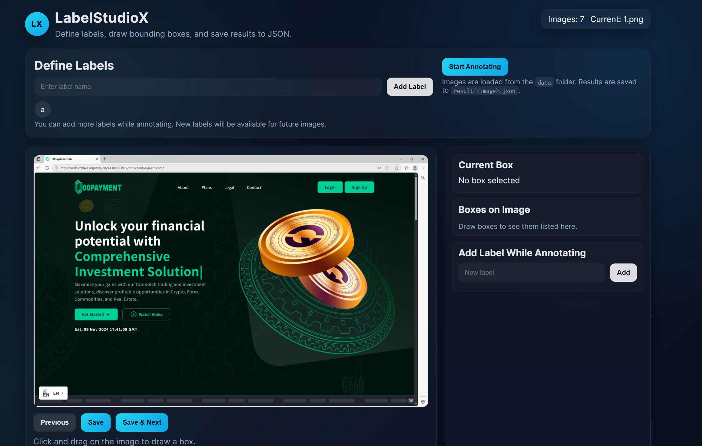

# LabelStudioX


LabelStudioX is a **lightweight, self-hosted image annotation tool** designed for drawing bounding boxes on images and exporting annotations as structured JSON files.

It runs completely **locally**, requires no database or cloud service, and is suitable for machine learning, computer vision, and AI dataset creation.

---

## ✨ Features

- 🏷️ **Custom Labels**
  - Add labels before or during annotation
- 🖼️ **Image Annotation**
  - Draw bounding boxes with mouse
  - Assign a label to each box
- 📂 **Local Image Loading**
  - Automatically loads images from the `data/` folder
- 💾 **Auto Save**
  - One JSON file per image
  - Output path: `result/<image_name>.json`
- 🎨 **Modern UI**
  - Dark theme
  - Clean panel-based layout
- 📴 **Fully Offline**
  - No uploads, no cloud dependency

---

## 🧱 Project Structure

```text
LabelStudioX/
├── LabelStudioX.exe     # Windows executable
├── data/                # Input images
├── result/              # Annotation outputs
├── public/              # Frontend assets (dev)
├── server.js            # Local server (dev)
└── README.md
````

---

## 🖥️ Requirements

### End Users (Recommended)

* Windows 10 / 11
* **No Node.js required**
* Use `LabelStudioX.exe` directly

### Developers

* Node.js ≥ 16
* npm ≥ 8

---

## 🚀 Usage (Executable Version)

### 1️⃣ Prepare Images

Create a folder next to the executable:

```text
data/
```

Put images inside:

```text
data/
├── 1.png
├── 2.jpg
```

Supported formats: `png / jpg / jpeg / bmp / gif`

---

### 2️⃣ Launch Application

Double-click:

```text
LabelStudioX.exe
```

You should see:

```text
LabelStudioX running at http://localhost:3000
```

---

### 3️⃣ Open Browser

Visit:

```
http://localhost:3000
```

---

### 4️⃣ Annotate Images

1. Enter label names and click **Add Label**
2. Click **Start Annotating**
3. Draw bounding boxes on the image
4. Assign labels
5. Click:

   * **Save**
   * **Save & Next**

---

### 5️⃣ Output

Results are saved automatically to:

```text
result/
└── <image_name>.json
```

Example:

```json
{
  "image": "1.png",
  "annotations": [
    {
      "label": "button",
      "center": { "x": 0.52, "y": 0.48 },
      "size": { "width": 0.32, "height": 0.18 }
    }
  ]
}
```

---

## 🛠️ Developer Mode (Optional)

```bash
npm install
npm start
```

Open:

```
http://localhost:3000
```

---

## ❓ FAQ

**Q: Images not loading?**
Make sure images are placed in the `data/` folder and filenames are valid.

**Q: Save not working?**
Check write permissions and ensure the `result/` folder exists.

**Q: Is any data uploaded?**
No. All processing is local.

---

## 📌 Use Cases

* Computer vision datasets
* Machine learning training data
* Research and experiments
* Small teams and personal projects

---

## 📄 License

MIT License

# LabelStudioX

LabelStudioX 是一款 **轻量级、本地运行的数据标注软件**，用于对图片进行目标框（Bounding Box）标注，并将结果导出为结构化的 JSON 文件，适用于机器学习、计算机视觉和 AI 数据集构建等场景。

本项目 **无需数据库、无需云服务**，所有数据均在本地完成，适合个人或小团队使用。

---

## ✨ 功能特性

- 🏷️ **自定义标签（Labels）**
  - 可在标注前或标注过程中随时新增标签
- 🖼️ **图片标注**
  - 鼠标拖拽绘制矩形框（Bounding Box）
  - 每个框可绑定一个标签
- 📂 **本地图片加载**
  - 自动读取 `data/` 文件夹中的图片
- 💾 **自动保存结果**
  - 每张图片生成一个 JSON 标注文件
  - 输出路径：`result/<image_name>.json`
- 🎨 **现代化界面**
  - 深色主题
  - 清晰的面板布局和状态反馈
- 📴 **完全离线**
  - 不上传、不联网，数据安全可控

---

## 🧱 目录结构说明

```text
LabelStudioX/
├── LabelStudioX.exe     # Windows 可执行程序
├── data/                # 放置待标注图片
├── result/              # 自动生成的标注结果
├── public/              # 前端静态资源（开发用）
├── server.js            # 本地服务（开发用）
└── README.md
````

---

## 🖥️ 运行环境

### 最终用户（推荐）

* Windows 10 / 11
* **无需安装 Node.js**
* 直接使用 `LabelStudioX.exe`

### 开发者

* Node.js ≥ 16
* npm ≥ 8

---

## 🚀 使用方式一：直接使用 exe（推荐）

### 1️⃣ 准备图片

在 `LabelStudioX.exe` 所在目录下创建文件夹：

```text
data/
```

将需要标注的图片放入其中，例如：

```text
data/
├── 1.png
├── 2.jpg
```

支持常见图片格式：`png / jpg / jpeg / bmp / gif`

---

### 2️⃣ 启动程序

双击：

```text
LabelStudioX.exe
```

终端窗口会显示：

```text
LabelStudioX running at http://localhost:3000
```

---

### 3️⃣ 打开浏览器

在浏览器中访问：

```
http://localhost:3000
```

即可进入标注界面。

---

### 4️⃣ 开始标注

1. 在 **Define Labels** 区域输入标签名，点击 **Add Label**
2. 点击 **Start Annotating**
3. 在图片上拖拽绘制标注框
4. 为标注框选择对应的标签
5. 点击：

   * **Save**：保存当前图片
   * **Save & Next**：保存并进入下一张图片

---

### 5️⃣ 查看结果

标注完成后，结果会自动保存到：

```text
result/
└── <image_name>.json
```

示例：

```json
{
  "image": "1.png",
  "annotations": [
    {
      "label": "button",
      "center": { "x": 0.52, "y": 0.48 },
      "size": { "width": 0.32, "height": 0.18 }
    }
  ]
}
```

---

## 🛠️ 使用方式二：开发模式运行（可选）

适合二次开发或调试。

```bash
npm install
npm start
```

浏览器打开：

```
http://localhost:3000
```

---

## ❓ 常见问题

### Q: 图片加载失败？

* 请确认图片放在 `data/` 文件夹中
* 文件名不要包含特殊字符或中文

### Q: 保存失败？

* 请确认程序所在目录有写权限
* 检查 `result/` 文件夹是否存在

### Q: 数据会上传到云端吗？

* **不会**
* 所有数据均在本地处理

---

## 📌 适用场景

* 计算机视觉数据集制作
* AI / ML 模型训练数据标注
* 教学演示与实验
* 小规模项目或个人研究

---

## 📄 License

MIT License


